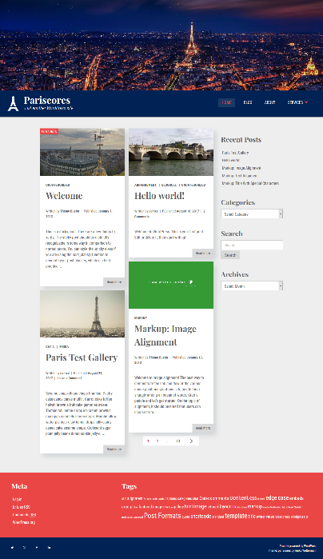

Pariscores is a brandnew and elegant blog theme. 

This theme showcases the best of Wordpress, based on the Underscores starter theme and was the project for a comprehensive Building Themes from Scratch course. 

It is highly customizable, fully responsive, accessible and cross browser compatible. It includes nice UX features like a sticky nav-bar, a dynamic to-top-button as well as an animated mobilemenu toggle button. It also supports SVG icons including fallbacks for old browsers.

